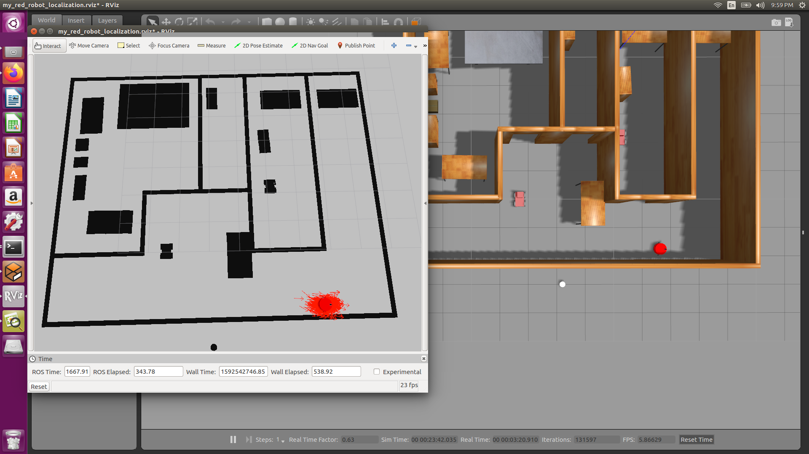

# Where Am I Project

Here is a picture of robot performing localization in a map in rviz comparing with Gazebo.


## Basic Build Instructions

1. Clone and build this repo using catkin_make.
2. Run world file.
```
roslaunch my_red_robot_localization world.launch
```
3. Run amcl launch file.
```
roslaunch my_red_orbot_localization amcl.launch
```
4. Use 2D Nav Goal in rviz navigate the robot.